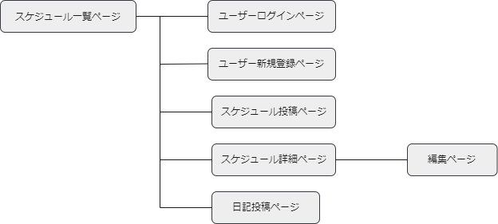

# README

# アプリケーション名
  ScheDiray-app

# アプリケーション概要
  カレンダーで日々のスケジュールを管理することができます。  
  日記を付けることもでき、毎日の記録ができます。

# URL
  https://schediary-app.onrender.com

# テスト用アカウント
- Basic認証ID：admin  
- Basic認証パスワード：2222  
- メールアドレス：test@test.com  
- パスワード：11111a  

# 利用方法
  1. トップページ（一覧ページ）のヘッダーからユーザー新規登録を行い、ログインする
  2. 予定を登録するボタンから、新規投稿ページで予定（日時、タイトル、内容）を登録する
  3. 日記ボタンから、日記の投稿をする

# アプリケーションを作成した背景
  旅行などの思い出を、スケジュール管理と記録を一緒にできるツールが欲しいと思い作成したアプリケーションです。  
  また、思い出だけでなく、自分の考えを整理したり、喜怒哀楽を吐き出せるようなアプリケーションがあったらいいな、  
  という思いもあり、作成しました。  
  簡単に使えるようにしたかったので、機能はシンプルなものにしています。  

# 洗い出した要件
  https://docs.google.com/spreadsheets/d/1R0nv1IZTiQ54EIx7lzDTDFB0YB93P646bj3pV2gZaGs/edit?usp=sharing

# 実装した機能についての画像やGIFおよびその説明
  1. トップページでは、アプリケーションの説明をしています。  
  
  2. 新規登録ボタンから、ユーザー新規登録ページに進み、必要な個所を入力して新規登録を行ってください。  
  
  3.

# 実装予定の機能
- 画像投稿機能  
- マイページ

# データベース設計
  

## users テーブル

| Column   | Type    | Options     |
| -------- | ------- | ----------- |
| nickname | string  | null: false |
| email    | string  | null: false |
| password | string  | null: false |
| birthday | date    | null: false |

### Association
- has_many :schedules
- has_many :diaries

## schedules テーブル
| Column     | Type       | Options                        |
| ---------- | ---------- | ------------------------------ |
| title      | string     | null: false                    |
| start_time | datetime   | null: false                    |
| content    | text       |                                |
| user       | references | null: false, foreign_key: true |
| diary      | references |                                |

### Association
- belongs_to :user
- has_many :diary

## diaries テーブル
| Column   | Type       | Options                        |
| -------- | ---------- | ------------------------------ |
| content  | text       | null: false                    |
| user     | references | null: false, foreign_key: true |
| schedule | references | foreign_key: true              |

### Association
- belongs_to :user
- belongs_to :schedule

# 画面遷移図
  

# 開発環境
- ruby '2.6.5'
- rails (6.0.6.1)
- mysql2 (0.5.5)

# ローカルでの動作方法
以下のコマンドを順に実行。

# 工夫したポイント
- 一覧ページで、月単位の予定を確認できるようにしています。  
- スケジュールを登録するときは、詳細な内容が決まっていなくてもタイトルだけで登録できます。編集ページでいつでも修正することができます。  

